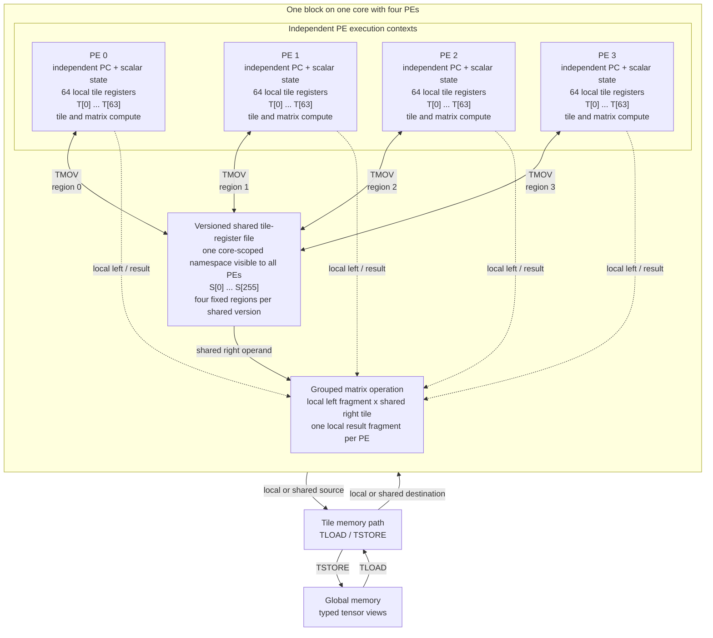

# Tile-ID Superscalar Execution

Tile operations form a dependency graph. The compiler assigns tile IDs, every
definition creates a version, and every consumer binds to the exact versions it
uses.

## Core Dataflow

The current execution profile maps one block to a core containing four PEs.
All four PEs begin at the same kernel entry, but each PE has its own program
counter, scalar control state, and private local tile-register file. Each local
file exposes 64 architectural tile names, `T[0]` through `T[63]`. Renaming may
create multiple physical versions of one architectural name; source code sees
only typed tile values and their dependencies.

<div class="snpu-diagram-scroll" markdown>



</div>

The arrows represent value movement rather than access to physical registers:

| Path | C++ operation | Programming meaning |
| --- | --- | --- |
| Global to local | `TLOAD(local_tile, global_view)` | Defines a new tile version in the issuing PE's local namespace |
| Local to global | `TSTORE(global_view, local_tile)` | Stores the issuing PE's valid local region |
| Global to shared | `TLOAD(shared_tile, global_view)` | One statically selected PE defines a fully populated shared version |
| Shared to global | `TSTORE(global_view, shared_tile)` | A selected issuer stores a complete shared value, or a supported partition form stores disjoint regions |
| Local to shared | `TMOV<SharedMove::Insert/Publish>` | Inserts one PE region or publishes one complete value |
| Shared to local | `TMOV<SharedMove::Extract/Broadcast>` | Extracts the PE's fixed region or copies a complete shared value |
| Shared to compute | `TMATMUL(local_c, local_a, shared_b)` | All participating PEs consume one shared right-hand-side version and define private result fragments |

A shared version has four fixed regions: region `i` corresponds to PE `i`.
Its defined-region mask is immutable, and the version becomes visible to an
ordinary consumer only after every defined region is ready. The shared file is
a versioned register class, not addressable shared memory: kernels cannot take
its address, inspect readiness, or manage its physical lifetime.

```cpp
const uint32_t thread = get_thread_idx();

LocalTile<half, kRowsPerThread, kK> local_a;
SharedTile<half, kK, kN> shared_b;
LocalTile<float, kRowsPerThread, kN> local_c;

TLOAD(local_a, lhs_rows_for(thread));
if (thread == 0) {
  TLOAD(shared_b, rhs_panel);       // global -> shared version
}

TMATMUL(local_c, local_a, shared_b);
TSTORE(output_rows_for(thread), local_c);  // local -> global
```

The selected shared load may arrive at a different cycle from each local load.
Correctness comes from the shared and local tile-version dependencies, while
the grouped matrix operation matches one dynamic instance across the four PEs.

## Definitions and Uses

```text
T#2.v1 = TLOAD(A)
T#3.v1 = TLOAD(B)
T#4.v1 = TADD(T#2.v1, T#3.v1)
T#5.v1 = TMULS(T#4.v1, alpha)
```

The two loads are independent. The add depends on both load versions. The
scale depends on the add version. A later write to `T#2` cannot change the
version already bound by `TADD`.

## Superscalar Issue

The implementation may issue independent tile operations out of source order
when this preserves:

- source-version dependencies;
- destination-version allocation;
- grouped-operation dynamic order;
- required global-memory conflict order;
- architectural exception and retirement rules.

Correct code therefore expresses ordering through values and memory effects,
not through spacing between instructions.

Fine-grained kernels often expose several short, independent chains at once.
See [Fine-grained 128-byte tile
kernels](../tutorials/fine-grained-tiles.md#expose-independent-tile-chains) for
an unrolled example whose loads and arithmetic are related only by tile
versions.

## Local Versions

Each thread tracks local tile versions independently. A branch may define a
tile only on one thread path. A merge point may use that tile only if the value
is defined on every path that reaches the consumer.

```cpp
if (thread == 0) {
  TLOAD(control_tile, control_view);
}
```

The example defines `control_tile` only on one path. Other paths cannot consume
it as a local value unless another definition covers those paths.

## Shared Versions

Shared definitions bind all participating threads to the same shared version.
A shared `TLOAD`, shared-destination `TMOV`, or shared-producing operation
creates a new version. A consumer must name the version through normal C++
dataflow.

Grouped operations that consume shared values wait for:

- every required local source version;
- the required shared source version;
- destination capacity for the new local or shared version;
- the dynamic participant set required by the operation.

## Relative Tile References

The target block encoding may refer to recent tile producers with compact
relative IDs. That encoding is a compiler and object-code detail. Source
correctness must not depend on physical tile-register numbers or on how long a
relative producer remains encodable.

## Tile-Version Ordering

A consumer is ordered after a producer when it consumes the producer's
tile version. Cross-block visibility requires a launch or runtime protocol
outside the kernel.
