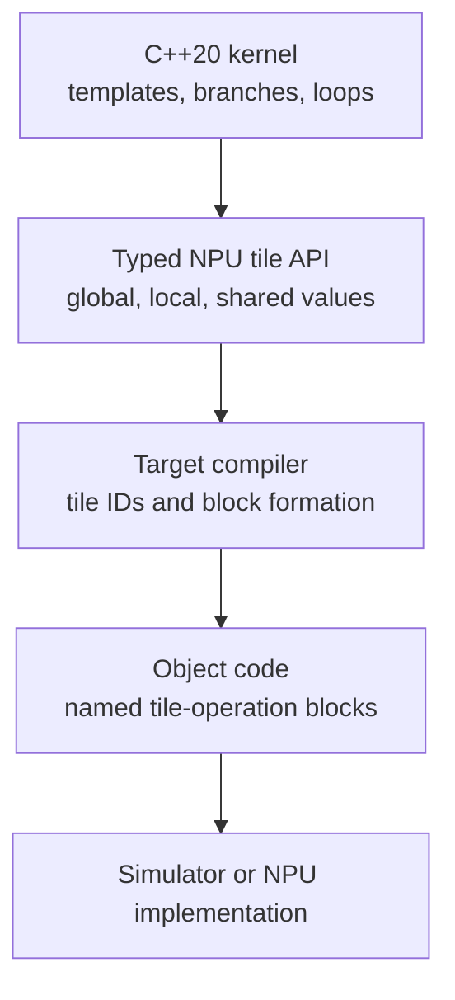

# Orientation

This repository documents how to write superscalar NPU kernels in C++. Kernel
authors write ordinary templates, control flow, and typed tensor views, then
call tile operations for movement and compute.

## The Stack

The layers have separate responsibilities:

| Layer | Author controls | Layer provides |
| --- | --- | --- |
| C++ source | templates, scalar control flow, pointer plumbing | concrete specializations and type checking |
| Tile API | tile location, element type, shape, layout, operation | a typed value graph for data movement and tensor compute |
| Compiler | target flags, optimization mode, lowering revision | tile IDs, tile versions, block encoding, scheduling |
| Runtime | launch shape, memory allocation, block assignment | external execution and memory setup |

## Mental Model

Start with block/thread identity, not physical registers. A block owns a slice
of the global problem. Each thread owns a fragment of that block slice. Local
tiles hold per-thread fragments, and shared tiles hold block-local values used
by multiple participating threads.

Tile operations are value definitions. A load defines a tile version, an
arithmetic operation consumes versions and defines another version, and a store
consumes a version. Independent definitions may issue in either order when
their operands are ready.

## Comparison With Familiar Models

| Question | CUDA-like answer | Triton-like answer | This C++ NPU model |
| --- | --- | --- | --- |
| Work identity | thread and thread block | program instance | block and thread identity |
| Local data | registers | blocked tensors | local tile values |
| Shared data | shared memory | explicit program dataflow | shared tile values |
| Global movement | loads and stores | masked block load/store | `TLOAD` and `TSTORE` on typed views |
| Matrix work | MMA intrinsic | `dot` | `TMATMUL` on local and shared tiles |

This is a comparison only. It does not imply source, ABI, launch, or memory
compatibility with CUDA or Triton.

## Next Steps

- Set up the tools in [Build the toolchain](toolchain.md).
- Compile the first tile program in [First tile program](first-program.md).
- Learn how outer dimensions and inner tile grids compose in
  [Multidimensional tiling](../tutorials/multidimensional-tiling.md).
- Read [Block and thread mapping](../model/core-indexing.md) before writing
  grouped kernels.
- Use [GEMM](../tutorials/gemm.md) and
  [FlashAttention](../tutorials/flash-attention.md) as end-to-end examples.
