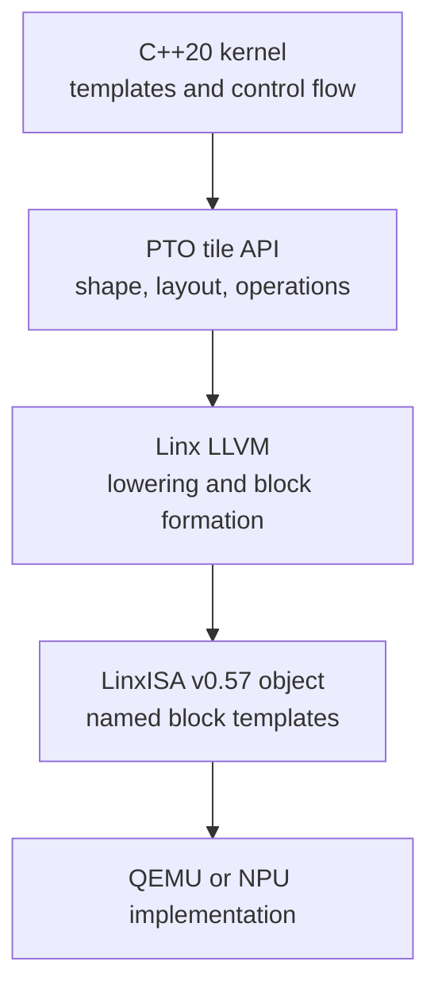

# Orientation

SuperNPUBench is both a workload suite and a set of concrete programming
examples for a Linx superscalar NPU. Kernel authors write ordinary C++ control
flow around typed tiles, then call PTO operations for data movement and tensor
compute. Linx LLVM lowers the result to the active v0.57 block-instruction
contract.

## Read the stack from top to bottom

The layers have different responsibilities:

| Layer | Author controls | Layer guarantees |
| --- | --- | --- |
| C++ | loops, templates, specialization, pointer plumbing | source-level types and compile-time checks |
| PTO | tile locations, layouts, shapes, operations | a portable tile/dataflow expression within the supported API |
| Linx LLVM | target flags and optimization mode | lowering to Linx object code and named v0.57 blocks |
| Runtime | launch, memory allocation, core assignment | platform-specific execution and synchronization |

## A useful comparison

CUDA commonly starts from threads and blocks. Triton commonly starts from a
program instance operating on blocked tensors. SuperNPUBench's PTO kernels
start from **typed tiles** and the dependencies between tile operations.

| Question | CUDA-like answer | Triton-like answer | PTO answer in this repository |
| --- | --- | --- | --- |
| Work unit | thread / thread block | program instance | C++ kernel and tile operation graph |
| Local data | registers / shared memory | blocked tensors | `Tile<Location, DType, Rows, Cols, ...>` |
| Global access | pointer instruction | masked block load/store | `global_tensor` view plus `TLOAD` / `TSTORE` |
| Matrix work | MMA intrinsic | `dot` | `TMATMUL` / `TMATMUL_ACC` |
| Specialization | templates / launch config | `constexpr` meta-parameters | C++ templates, macros, and `if constexpr` |

This comparison is conceptual. It does not imply source, ABI, or memory-model
compatibility with CUDA or Triton.

## Choose a reading path

  
<h3>New kernel author</h3>
Set up LLVM, compile the tile-add example, then work through GEMM.
<a href="../toolchain/">Build the toolchain →</a>

  
<h3>Architecture reader</h3>
Separate programming, execution, memory, consistency, and four-PE group contracts.
<a href="../../model/programming/">Open the models →</a>

  
<h3>Benchmark contributor</h3>
Find a suite, its entrypoint, build matrix, and emitted artifacts.
<a href="../../benchmarks/">Browse benchmarks →</a>

## Active compatibility boundary

The checked-in hardware path targets `linx64-linx-none-elf` and LinxISA v0.57.
Use named template blocks such as `BSTART.TLOAD` and `BSTART.TSTORE`. Numeric
PTO selectors and retired target spellings are outside this guide's active
contract.
